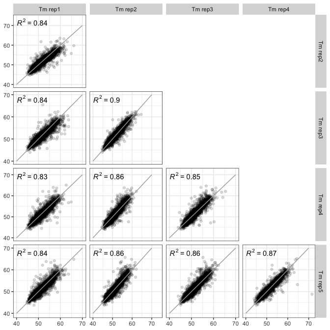
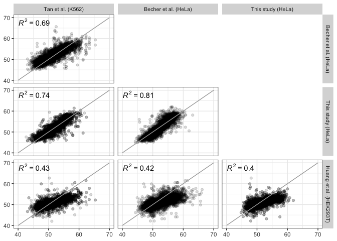

<!-- README.md is generated from README.Rmd. Please edit that file -->

# phosphoTPP

<!-- badges: start -->

[](https://travis-ci.org/nkurzaw/phosphoTPP)
<!-- badges: end -->

> Analysis of the phosphoTPP dataset by Potel et al. and comparison to
> Huang et al.

Potel\*, Kurzawa\*, Becher\*, et al. 2020. "Impact of Phosphorylation on
Thermal Stability of Proteins." *BioRxiv*, <https://doi.org/10.1101/2020.01.14.903849>

# Introduction

This vignette illustrates the analysis of the phosphoTPP dataset by
Potel et al. (2020) and compares it to the one by Huang et al. (2019).

# Step-by-step walk through the analysis

## Download of required data sets

The supplementary tables `41592_2019_499_MOESM3_ESM.xlsx` and
`41592_2019_499_MOESM4_ESM.xlsx` by Huang et al. (2019) can be
downloaded from the journal website:
<https://www.nature.com/articles/s41592-019-0499-3#Sec26> .

The supplementary tables `56035_2_data_set_478471_pxb8gk.xlsx` and
`56035_2_data_set_478475_pxb8l1-tableS3.xlsx` by Ochoa et al. (2020) can
also be downloaded from the respective journal website:
<https://www.nature.com/articles/s41587-019-0344-3#Sec30> .

The processed data by Potel et al. (2020) and reprocessed data by Huang
et al. (2019) can be downloaded from Mendeley:
<https://data.mendeley.com/datasets/4vwzvxfcnd/4>

The table `1-s2.0-S0092867418303854-mmc4.xlsx` (used for supplementary
figures comparing different TPP-TR experiments) can be downloaded from
the respective journal website:
<https://www.sciencedirect.com/science/article/pii/S0092867418303854#app2>

All tables should be saved in the `dat` folder of the package.

## Setup

Install the `phosphoTPP` package from github

``` r
if (!requireNamespace("devtools", quietly = TRUE))
    install.packages("devtools")
devtools::install_github("nkurzaw/phosphoTPP")
```

We then load the required libraries

``` r
library(phosphoTPP)
library(dplyr)
library(readr)
library(tidyr)
library(readxl)
library(GGally)
library(ggpmisc)
```

Set some plotting options

``` r
# set plotting sizes
anno_size <- 2
pval_size <- 2
rsq_size <- 2

# define plotting theme
theme_paper <- 
  theme(axis.title = element_text(size = 8),
        axis.text = element_text(size = 6),
        legend.text = element_text(size = 6),
        title = element_text(size = 9))
```

And we set the thresholds for filtering for high-quality peptide
identifications and quantifications and the filtering criteria for
melting curves.

``` r
# set thresholds for quality filtering
s2i_thres <-  0.5
p2t_thres <-  4
mascot_score_thres <- 20
fdr_at_score_thres <- 0.01
r2_thres <- 0.8
plateau_thres <- 0.2
```

## Walk through the analysis

Load the config table which tells us which TMT channels were used for
which temperature treatment

``` r
cfg_tab <- readxl::read_xlsx(file.path("dat", "TPP-TR_config_phospho.xlsx"))
cfg_tab
#> # A tibble: 1 x 15
#>   Experiment Condition Comparison1 Comparison2 Comparison3 `126` `127L` `127H`
#>   <chr>      <chr>     <chr>       <lgl>       <lgl>       <dbl>  <dbl>  <dbl>
#> 1 phospho_p… Vehicle   x           NA          NA             37   40.4     44
#> # … with 7 more variables: `128L` <dbl>, `128H` <dbl>, `129L` <dbl>,
#> #   `129H` <dbl>, `130L` <dbl>, `130H` <dbl>, `131L` <dbl>
```

We then create the temperature annotation data frames for the
phosphopeptide and unmodified samples

``` r
temperature_anno <- cfg_tab %>%
  dplyr::select(matches('[0-9]{3}')) %>%
  gather(key, temperature) %>%
  mutate(channel = paste("sig", key, sep = "_")) %>% 
  mutate(fc_channel = paste("rel_fc", key, sep = "_"))

temperature_anno_prot <- cfg_tab  %>%
  dplyr::select(matches('[0-9]{3}')) %>%
  gather(key, temperature) %>%
  mutate(channel = paste("signal_sum", key, sep = "_")) %>% 
  mutate(fc_channel = paste("rel_fc", key, sep = "_"))
```

We now identify the different raw input files

``` r
# read in lists of phospho and nbt protein and peptides tables per replicate
phospho_protein_files <- list.files("dat", pattern = 'phospho.+protein', full.names = TRUE)
phospho_protein_files
#> [1] "dat/S1890_phospho_merged_results_20190905_1944_proteins.txt"
#> [2] "dat/S1896_phospho_merged_results_20190918_2203_proteins.txt"
#> [3] "dat/S1897_phospho_merged_results_20190920_0600_proteins.txt"
#> [4] "dat/S1921_phospho_merged_results_20191009_0018_proteins.txt"
#> [5] "dat/S1922_phospho_merged_results_20191010_2335_proteins.txt"
```

``` r
nbf_protein_files <- list.files("dat", pattern = 'NBF.+protein', full.names = TRUE)
nbf_protein_files
#> [1] "dat/S1890_NBF_merged_results_20190917_1702_proteins.txt"
#> [2] "dat/S1896_NBF_merged_results_20190922_0108_proteins.txt"
#> [3] "dat/S1897_NBF_merged_results_20190923_1614_proteins.txt"
#> [4] "dat/S1921_NBF_merged_results_20191009_1950_proteins.txt"
#> [5] "dat/S1922_NBF_merged_results_20191011_2001_proteins.txt"
```

``` r
phospho_peptide_files <- list.files("dat", pattern = 'phospho.+peptide.+txt', full.names = TRUE)
phospho_peptide_files
#> [1] "dat/S1890_phospho_merged_results_20190905_1944_peptides.txt"
#> [2] "dat/S1896_phospho_merged_results_20190918_2203_peptides.txt"
#> [3] "dat/S1897_phospho_merged_results_20190920_0600_peptides.txt"
#> [4] "dat/S1921_phospho_merged_results_20191009_0018_peptides.txt"
#> [5] "dat/S1922_phospho_merged_results_20191010_2335_peptides.txt"
```

``` r
phosho_mxq_peptide_files <- list.files("dat", pattern = 'pTPP.+txt', full.names = TRUE)
phosho_mxq_peptide_files
#> [1] "dat/pTPP_R1_phospho_evidence.txt" "dat/pTPP_R2_phospho_evidence.txt"
#> [3] "dat/pTPP_R3_phospho_evidence.txt" "dat/pTPP_R4_phospho_evidence.txt"
#> [5] "dat/pTPP_R5_phospho_evidence.txt"
```

``` r
nbf_peptide_files <- list.files("dat", pattern = 'NBF.+peptide', full.names = TRUE)
nbf_peptide_files
#> [1] "dat/S1890_NBF_merged_results_20190917_1702_peptides.txt"
#> [2] "dat/S1896_NBF_merged_results_20190922_0108_peptides.txt"
#> [3] "dat/S1897_NBF_merged_results_20190923_1614_peptides.txt"
#> [4] "dat/S1921_NBF_merged_results_20191009_1950_peptides.txt"
#> [5] "dat/S1922_NBF_merged_results_20191011_2001_peptides.txt"
```

Then, we read in the individual files into a list of replicate data for
the respective data types (‘phosphoproteins’, unmodified proteins,
phosphopeptides, unmodified peptides, etc.)

``` r
# read data files into lists of replicates
phospho_protein_tabs <- lapply(seq_len(length(phospho_protein_files)), function(file_i){
  read_delim(phospho_protein_files[file_i], delim = "\t") %>% 
    mutate(replicate = file_i)
})

nbf_protein_tabs <- lapply(seq_len(length(nbf_protein_files)), function(file_i){
  read_delim(nbf_protein_files[file_i], delim = "\t") %>% 
    mutate(replicate = file_i)
})

phospho_peptide_tabs <- lapply(seq_len(length(phospho_peptide_files)), function(file_i){
  ibq_tab <- read_delim(phospho_peptide_files[file_i], delim = "\t") %>% 
    filter_at(vars(starts_with("sig_")), all_vars(!is.na(.))) 
  mxq_tab <- read_delim(phosho_mxq_peptide_files[file_i], delim = "\t")
  
  combined_tab <- left_join(
  ibq_tab %>% dplyr::select(protein_id, sequence, modifications,
                            matches("sig_"), s2i, p2t, msms_id),
  mxq_tab %>% dplyr::select(protein_id_mxq = Proteins, sequence = Sequence, msms_id = `MS/MS scan number`,
                            mod_sequence = `Modified sequence`, phospho_prob = `Phospho (STY) Probabilities`,
                            phospho_score_diff = `Phospho (STY) Score Diffs`, phospho_site_STY = `Phospho (STY)`),
  by = c("sequence", "msms_id")) %>%
  filter(!is.na(protein_id_mxq)) %>%
  group_by(sequence, msms_id) %>%
  filter(!duplicated(mod_sequence)) %>%
  ungroup %>%
  filter(getProb(phospho_prob)) %>%
  filter(p2t >= p2t_thres, s2i >= s2i_thres) %>% 
  mutate(replicate = file_i) %>% 
    mutate(rel_fc_126 = sig_126 / sig_126,
           rel_fc_127L = sig_127L / sig_126,
           rel_fc_127H = sig_127H / sig_126,
           rel_fc_128L = sig_128L / sig_126,
           rel_fc_128H = sig_128H / sig_126,
           rel_fc_129L = sig_129L / sig_126,
           rel_fc_129H = sig_129H / sig_126,
           rel_fc_130L = sig_130L / sig_126,
           rel_fc_130H = sig_130H / sig_126,
           rel_fc_131L = sig_131L / sig_126)
  
  return(combined_tab)
})

phospho_non_phospho_peptide_tabs <- lapply(seq_len(length(phospho_peptide_files)), function(file_i){
  read_delim(phospho_peptide_files[file_i], delim = "\t") %>% 
    filter(is_decoy == 0, score > mascot_score_thres & is_unique == 1, rank == 1,
           fdr_at_score < fdr_at_score_thres, !is.na(modifications), 
           grepl("TMT", modifications), !grepl("Phospho", modifications),
           in_quantification_of_protein == 1, !grepl("##", protein_id)) %>%
    filter_at(vars(starts_with("sig_")), all_vars(!is.na(.))) %>% 
    mutate(replicate = file_i) %>% 
    mutate(rel_fc_126 = sig_126 / sig_126,
           rel_fc_127L = sig_127L / sig_126,
           rel_fc_127H = sig_127H / sig_126,
           rel_fc_128L = sig_128L / sig_126,
           rel_fc_128H = sig_128H / sig_126,
           rel_fc_129L = sig_129L / sig_126,
           rel_fc_129H = sig_129H / sig_126,
           rel_fc_130L = sig_130L / sig_126,
           rel_fc_130H = sig_130H / sig_126,
           rel_fc_131L = sig_131L / sig_126)
})

nbf_peptide_tabs <- lapply(seq_len(length(nbf_peptide_files)), function(file_i){
  read_delim(nbf_peptide_files[file_i], delim = "\t") %>% 
    filter(is_decoy == 0, score > mascot_score_thres & is_unique == 1, rank == 1,
           fdr_at_score < fdr_at_score_thres, !is.na(modifications), 
           grepl("TMT", modifications), 
           in_quantification_of_protein == 1, !grepl("##", protein_id)) %>%
    filter_at(vars(starts_with("sig_")), all_vars(!is.na(.))) %>% 
    mutate(replicate = file_i) %>% 
    mutate(rel_fc_126 = sig_126 / sig_126,
           rel_fc_127L = sig_127L / sig_126,
           rel_fc_127H = sig_127H / sig_126,
           rel_fc_128L = sig_128L / sig_126,
           rel_fc_128H = sig_128H / sig_126,
           rel_fc_129L = sig_129L / sig_126,
           rel_fc_129H = sig_129H / sig_126,
           rel_fc_130L = sig_130L / sig_126,
           rel_fc_130H = sig_130H / sig_126,
           rel_fc_131L = sig_131L / sig_126)
})
```

Next, we compute our first level normalization factors which normalize
all peptides based on non-phosphorylated peptides found in matching
replicates of phospho-enriched and non-bound fraction samples.

``` r
n_rep <- min(length(phospho_peptide_files),
             length(nbf_peptide_files))

per_exp_norm_factors <- lapply(seq_len(n_rep), function(rep_i){
  norm_in_df <- bind_rows(nbf_peptide_tabs[[rep_i]] %>% 
    mutate(dataset_id = paste("nbf", replicate, sep = "_")),
    phospho_non_phospho_peptide_tabs[[rep_i]] %>% 
    mutate(dataset_id = paste("phospho", replicate, sep = "_")))
  
  nbf_peptide_norm_factors <- getNormFactors4Data(
    pep_tab = norm_in_df, 
    temperature_anno = temperature_anno,
    filter_criteria = list("rel_fc_127H_low" = 0,
                           "rel_fc_129H_low" = 0.4,
                           "rel_fc_129H_high" = 0.6,
                           "rel_fc_130H_low" = 0,
                           "rel_fc_130H_high" = 0.3,
                           "rel_fc_131L_low" = 0,
                           "rel_fc_131L_high" = 0.2),
    n_rep = 2)
  
  median_norm_factors <- nbf_peptide_norm_factors
  out_df <- tibble(
    temperature = nbf_peptide_norm_factors[[1]]$temperature,
    median_norm_factor = nbf_peptide_norm_factors[[1]]$median_rel_value /
      nbf_peptide_norm_factors[[2]]$median_rel_value)
  
  return(out_df)
})

per_exp_norm_factors
#> [[1]]
#> # A tibble: 10 x 2
#>    temperature median_norm_factor
#>          <dbl>              <dbl>
#>  1        37                1    
#>  2        40.4              0.938
#>  3        44                0.978
#>  4        46.9              1.04 
#>  5        49.8              1.06 
#>  6        52.9              1.10 
#>  7        55.5              1.24 
#>  8        58.6              1.14 
#>  9        62                1.05 
#> 10        66.3              0.781
#> 
#> [[2]]
#> # A tibble: 10 x 2
#>    temperature median_norm_factor
#>          <dbl>              <dbl>
#>  1        37                1    
#>  2        40.4              0.976
#>  3        44                1.06 
#>  4        46.9              1.06 
#>  5        49.8              1.20 
#>  6        52.9              1.45 
#>  7        55.5              1.11 
#>  8        58.6              1.08 
#>  9        62                1.01 
#> 10        66.3              0.996
#> 
#> [[3]]
#> # A tibble: 10 x 2
#>    temperature median_norm_factor
#>          <dbl>              <dbl>
#>  1        37                1    
#>  2        40.4              0.912
#>  3        44                1.03 
#>  4        46.9              0.998
#>  5        49.8              1.10 
#>  6        52.9              1.12 
#>  7        55.5              1.13 
#>  8        58.6              1.34 
#>  9        62                1.30 
#> 10        66.3              1.05 
#> 
#> [[4]]
#> # A tibble: 10 x 2
#>    temperature median_norm_factor
#>          <dbl>              <dbl>
#>  1        37                1    
#>  2        40.4              0.948
#>  3        44                1.08 
#>  4        46.9              1.02 
#>  5        49.8              1.01 
#>  6        52.9              0.960
#>  7        55.5              0.909
#>  8        58.6              0.935
#>  9        62                1.60 
#> 10        66.3              0.797
#> 
#> [[5]]
#> # A tibble: 10 x 2
#>    temperature median_norm_factor
#>          <dbl>              <dbl>
#>  1        37                1    
#>  2        40.4              0.986
#>  3        44                1.02 
#>  4        46.9              0.985
#>  5        49.8              0.931
#>  6        52.9              1.03 
#>  7        55.5              1.16 
#>  8        58.6              1.09 
#>  9        62                1.09 
#> 10        66.3              1.07
```

Then, we retrieve our second level of normalization factors which
perform the normalization described by Savitski et al. (2014)
(originally done on protein level) which normalize peptide fold changes
in the different temperature channels towards the melting curve of
median values retrieved from high-quality melting peptides.

``` r
norm_in_df <- 
  bind_rows(nbf_peptide_tabs) %>% 
    mutate(dataset_id = paste("nbf", replicate, sep = "_"))#,

nbf_peptide_norm_factors <- getNormFactors4Data(
  pep_tab = norm_in_df, 
  temperature_anno = temperature_anno,
      filter_criteria = list("rel_fc_127H_low" = 1,
                           "rel_fc_129H_low" = 0.4,
                           "rel_fc_129H_high" = 0.6,
                           "rel_fc_130H_low" = 0,
                           "rel_fc_130H_high" = 0.3,
                           "rel_fc_131L_low" = 0,
                           "rel_fc_131L_high" = 0.2),
  n_rep = n_rep)

nbf_peptide_norm_factors
#> [[1]]
#> # A tibble: 10 x 4
#>    temperature median_rel_value norm_factor predicted
#>          <dbl>            <dbl>       <dbl>     <dbl>
#>  1        37             1            0.999    0.999 
#>  2        40.4           1.04         0.953    0.993 
#>  3        44             1.04         0.927    0.966 
#>  4        46.9           0.951        0.944    0.898 
#>  5        49.8           0.633        1.17     0.744 
#>  6        52.9           0.553        0.896    0.495 
#>  7        55.5           0.308        0.984    0.303 
#>  8        58.6           0.150        1.09     0.163 
#>  9        62             0.0878       1.09     0.0954
#> 10        66.3           0.0721       0.924    0.0666
#> 
#> [[2]]
#> # A tibble: 10 x 4
#>    temperature median_rel_value norm_factor predicted
#>          <dbl>            <dbl>       <dbl>     <dbl>
#>  1        37              1           0.999    0.999 
#>  2        40.4            0.593       1.67     0.993 
#>  3        44              1.20        0.803    0.966 
#>  4        46.9            1.06        0.848    0.898 
#>  5        49.8            1.16        0.643    0.744 
#>  6        52.9            0.752       0.658    0.495 
#>  7        55.5            0.495       0.612    0.303 
#>  8        58.6            0.292       0.557    0.163 
#>  9        62              0.165       0.577    0.0954
#> 10        66.3            0.100       0.664    0.0666
#> 
#> [[3]]
#> # A tibble: 10 x 4
#>    temperature median_rel_value norm_factor predicted
#>          <dbl>            <dbl>       <dbl>     <dbl>
#>  1        37              1           0.999    0.999 
#>  2        40.4            0.785       1.27     0.993 
#>  3        44              1.20        0.802    0.966 
#>  4        46.9            0.992       0.905    0.898 
#>  5        49.8            1.22        0.611    0.744 
#>  6        52.9            0.785       0.631    0.495 
#>  7        55.5            0.573       0.529    0.303 
#>  8        58.6            0.291       0.560    0.163 
#>  9        62              0.207       0.461    0.0954
#> 10        66.3            0.136       0.489    0.0666
#> 
#> [[4]]
#> # A tibble: 10 x 4
#>    temperature median_rel_value norm_factor predicted
#>          <dbl>            <dbl>       <dbl>     <dbl>
#>  1        37              1           0.999    0.999 
#>  2        40.4            0.456       2.18     0.993 
#>  3        44              0.760       1.27     0.966 
#>  4        46.9            1.32        0.678    0.898 
#>  5        49.8            1.34        0.557    0.744 
#>  6        52.9            0.919       0.539    0.495 
#>  7        55.5            0.546       0.555    0.303 
#>  8        58.6            0.258       0.632    0.163 
#>  9        62              0.155       0.615    0.0954
#> 10        66.3            0.127       0.522    0.0666
#> 
#> [[5]]
#> # A tibble: 10 x 4
#>    temperature median_rel_value norm_factor predicted
#>          <dbl>            <dbl>       <dbl>     <dbl>
#>  1        37              1           0.999    0.999 
#>  2        40.4            1.18        0.838    0.993 
#>  3        44              1.19        0.809    0.966 
#>  4        46.9            1.22        0.737    0.898 
#>  5        49.8            0.999       0.745    0.744 
#>  6        52.9            0.783       0.632    0.495 
#>  7        55.5            0.458       0.662    0.303 
#>  8        58.6            0.232       0.700    0.163 
#>  9        62              0.153       0.622    0.0954
#> 10        66.3            0.104       0.638    0.0666
```

Now, we apply both normalization factors and visualize the melting
curves for our phosphopeptides and non-bound fraction peptides.

``` r
nbf_peptide_filtered <- bind_rows(lapply(seq_len(length(nbf_peptide_tabs)),
                                       function(tab_i){
  nbf_peptide_tabs[[tab_i]] %>%
    dplyr::select(protein_id, sequence, modifications,
                  matches("rel_fc_"), replicate, score) %>%
    gather(key, value, -protein_id, -sequence, -modifications,
           -replicate, -score) %>%
    group_by(protein_id, sequence, replicate, modifications, key) %>%
    filter(score == max(score)) %>%
    left_join(temperature_anno, by = c("key" = "fc_channel")) %>%
    left_join(nbf_peptide_norm_factors[[tab_i]],
              by = "temperature") %>% 
    mutate(rel_value = value * norm_factor) %>% 
    left_join(nbf_protein_tabs[[tab_i]] %>% dplyr::select(protein_id, gene_name),
              by = c("protein_id")) 
}))

phospho_peptide_tab_filtered <- bind_rows(lapply(seq_len(length(phospho_peptide_tabs)), function(tab_i){
  phospho_peptide_tabs[[tab_i]] %>%
    dplyr::select(-matches("sig_")) %>% 
    gather(key, value, matches("rel_fc_")) %>%
    group_by(protein_id, sequence, mod_sequence, phospho_site_STY, 
             replicate, key) %>%
    summarise(value = mean(value, na.rm = TRUE),
              mean_s2i = mean(s2i, na.rm = TRUE),
              mean_p2t = mean(p2t, na.rm = TRUE)) %>%
    ungroup %>%
    left_join(temperature_anno %>% dplyr::select(-key),
              by = c("key" = "fc_channel")) %>%
    left_join(per_exp_norm_factors[[tab_i]],
              by = "temperature") %>% 
    left_join(nbf_peptide_norm_factors[[tab_i]],
              by = "temperature") %>% 
    mutate(rel_value = value * median_norm_factor * norm_factor) %>%
    left_join(phospho_protein_tabs[[tab_i]] %>% 
                dplyr::select(protein_id, gene_name),
              by = c("protein_id")) %>%
    filter(!grepl("##", protein_id))
}))
#> `summarise()` regrouping output by 'protein_id', 'sequence', 'mod_sequence', 'phospho_site_STY', 'replicate' (override with `.groups` argument)
#> `summarise()` regrouping output by 'protein_id', 'sequence', 'mod_sequence', 'phospho_site_STY', 'replicate' (override with `.groups` argument)
#> `summarise()` regrouping output by 'protein_id', 'sequence', 'mod_sequence', 'phospho_site_STY', 'replicate' (override with `.groups` argument)
#> `summarise()` regrouping output by 'protein_id', 'sequence', 'mod_sequence', 'phospho_site_STY', 'replicate' (override with `.groups` argument)
#> `summarise()` regrouping output by 'protein_id', 'sequence', 'mod_sequence', 'phospho_site_STY', 'replicate' (override with `.groups` argument)


p_qc1 <- nbf_peptide_filtered %>% 
  ggplot(aes(temperature, rel_value)) + 
  geom_boxplot(aes(group = temperature)) + 
  facet_wrap(~replicate) + 
  coord_cartesian(ylim = c(0, 2.5))

p_qc2 <- phospho_peptide_tab_filtered %>% 
  ggplot(aes(temperature, rel_value)) + 
  geom_boxplot(aes(group = temperature)) + 
  facet_wrap(~replicate) + 
  coord_cartesian(ylim = c(0, 2.5))

cowplot::plot_grid(p_qc1 + ggtitle("nbf"), 
                   p_qc2 + ggtitle("phospho"), 
                   ncol = 2)
```

<!-- -->

We then fit sigmoids to the melting profiles of the non-bound fractions
peptides

``` r
# fit curves to nbf dataset
out_nbf_df <- nbf_peptide_filtered %>% 
  group_by(gene_name, replicate) %>%
  do({
    suppressWarnings(fitMeltcurveModelAndEval(df = .))
  }) %>% 
  ungroup
```

We then filter for hiqh quality fit according to the criteria defined by
Savitski et al. (2014) and inspect reproducibility by visualization of
melting point scatter plots between the different replicates

``` r
# filter for high quality fits
nbf_tm_rep_df <- out_nbf_df %>% 
  filter(rSq > r2_thres, plateau < plateau_thres) %>% 
  dplyr::select(gene_name, replicate, meltPoint) %>% 
  spread(replicate, meltPoint)

pm <- GGally::ggpairs(nbf_tm_rep_df, 2:6,
        upper = "blank", diag = NULL,
        lower = list(continuous = GGally::wrap(lowerFn)))

GGally::ggmatrix(list(pm[2, 1], NULL, NULL, NULL,
              pm[3, 1], pm[3,2], NULL, NULL,
              pm[4, 1], pm[4,2], pm[4,3], NULL,
              pm[5, 1], pm[5,2], pm[5,3], pm[5,4]), 4, 4,
         xAxisLabels = c("Tm rep1", "Tm rep2", "Tm rep3", "Tm rep4"),
         yAxisLabels = c("Tm rep2", "Tm rep3","Tm rep4","Tm rep5"))
#> Warning: Removed 2773 rows containing non-finite values (stat_poly_eq).
#> Warning: Removed 2773 rows containing missing values (geom_point).
#> Warning: Removed 2701 rows containing non-finite values (stat_poly_eq).
#> Warning: Removed 2701 rows containing missing values (geom_point).
#> Warning: Removed 2336 rows containing non-finite values (stat_poly_eq).
#> Warning: Removed 2336 rows containing missing values (geom_point).
#> Warning: Removed 3015 rows containing non-finite values (stat_poly_eq).
#> Warning: Removed 3015 rows containing missing values (geom_point).
#> Warning: Removed 2882 rows containing non-finite values (stat_poly_eq).
#> Warning: Removed 2882 rows containing missing values (geom_point).
#> Warning: Removed 2801 rows containing non-finite values (stat_poly_eq).
#> Warning: Removed 2801 rows containing missing values (geom_point).
#> Warning: Removed 2744 rows containing non-finite values (stat_poly_eq).
#> Warning: Removed 2744 rows containing missing values (geom_point).
#> Warning: Removed 2558 rows containing non-finite values (stat_poly_eq).
#> Warning: Removed 2558 rows containing missing values (geom_point).
#> Warning: Removed 2460 rows containing non-finite values (stat_poly_eq).
#> Warning: Removed 2460 rows containing missing values (geom_point).
#> Warning: Removed 2711 rows containing non-finite values (stat_poly_eq).
#> Warning: Removed 2711 rows containing missing values (geom_point).
```

<!-- -->

Next, we fit sigmoids to the melting profiles of the phosphopeptides

``` r
# fit phospho peptide melting curves
out_phospho_df <- phospho_peptide_tab_filtered %>%
  dplyr::select(protein_id, gene_name, sequence, 
                mod_sequence, mean_s2i, mean_p2t,
                phospho_site_STY, replicate, 
                rel_value, temperature) %>%
  group_by(protein_id, gene_name, sequence, 
           mod_sequence, mean_s2i, mean_p2t,
           phospho_site_STY, replicate) %>%
  do({
    suppressWarnings(fitMeltcurveModelAndEval(df = .))
  }) %>% 
  ungroup
```

And again we inspect reproducibility by visualizing scatter plots of
meling points estimated in the different replicates

``` r
phospho_tm_rep_df <- out_phospho_df %>% 
  filter(rSq > r2_thres, plateau < plateau_thres) %>% 
  dplyr::select(gene_name, sequence, mod_sequence, phospho_site_STY, replicate, meltPoint) %>% 
  spread(replicate, meltPoint)

pm_phospho <- ggpairs(phospho_tm_rep_df, 5:9,
        upper = "blank", diag = NULL,
        lower = list(continuous = wrap(lowerFn)))

ggmatrix(list(pm_phospho[2, 1], NULL, NULL, NULL,
              pm_phospho[3, 1], pm_phospho[3,2], NULL, NULL,
              pm_phospho[4, 1], pm_phospho[4,2], pm_phospho[4,3], NULL,
              pm_phospho[5, 1], pm_phospho[5,2], pm_phospho[5,3], pm_phospho[5,4]), 4, 4,
         xAxisLabels = c("Tm rep1", "Tm rep2", "Tm rep3", "Tm rep4"),
         yAxisLabels = c("Tm rep2", "Tm rep3","Tm rep4","Tm rep5"))
#> Warning: Removed 17724 rows containing non-finite values (stat_poly_eq).
#> Warning: Removed 17724 rows containing missing values (geom_point).
#> Warning: Removed 17670 rows containing non-finite values (stat_poly_eq).
#> Warning: Removed 17670 rows containing missing values (geom_point).
#> Warning: Removed 16281 rows containing non-finite values (stat_poly_eq).
#> Warning: Removed 16281 rows containing missing values (geom_point).
#> Warning: Removed 19680 rows containing non-finite values (stat_poly_eq).
#> Warning: Removed 19680 rows containing missing values (geom_point).
#> Warning: Removed 18969 rows containing non-finite values (stat_poly_eq).
#> Warning: Removed 18969 rows containing missing values (geom_point).
#> Warning: Removed 18756 rows containing non-finite values (stat_poly_eq).
#> Warning: Removed 18756 rows containing missing values (geom_point).
#> Warning: Removed 19143 rows containing non-finite values (stat_poly_eq).
#> Warning: Removed 19143 rows containing missing values (geom_point).
#> Warning: Removed 18306 rows containing non-finite values (stat_poly_eq).
#> Warning: Removed 18306 rows containing missing values (geom_point).
#> Warning: Removed 18026 rows containing non-finite values (stat_poly_eq).
#> Warning: Removed 18026 rows containing missing values (geom_point).
#> Warning: Removed 18849 rows containing non-finite values (stat_poly_eq).
#> Warning: Removed 18849 rows containing missing values (geom_point).
```

<!-- -->

Now we join our results of the melting curve fitting for phosphopeptides
and unmodified proteins and apply the test for differential melting
points established by Savitski et al. (2014)

``` r
nbf_tm_rep_fil <- out_nbf_df %>% 
  filter(rSq > r2_thres, plateau < plateau_thres) %>% 
  group_by(gene_name) %>% 
  filter(n() > 2) %>% 
  ungroup %>% 
  dplyr::select(gene_name, replicate, meltPoint) %>% 
  spread(replicate, meltPoint)

phospho_tm_rep_fil <- out_phospho_df %>% 
  filter(rSq > r2_thres, plateau < plateau_thres) %>% 
  group_by(gene_name, sequence, mod_sequence, phospho_site_STY) %>% 
  filter(n() > 2) %>% 
  ungroup() %>% 
  dplyr::select(gene_name, sequence, mod_sequence, phospho_site_STY, replicate, meltPoint) %>% 
  spread(replicate, meltPoint)

combo_tm_df <- left_join(phospho_tm_rep_fil, nbf_tm_rep_fil,
          by = "gene_name") %>% 
  rowwise() %>% 
  mutate(id = paste(gene_name, mod_sequence, phospho_site_STY, sep = "_")) %>% 
  ungroup()

combo_mean_tm_significant_df <- combo_tm_df %>%
  rowwise() %>%
  mutate(mean_phospho = mean(c(`1.x`, `2.x`, `3.x`, `4.x`, `5.x`), na.rm = TRUE),
         mean_nbf = mean(c(`1.y`, `2.y`, `3.y`, `4.y`, `5.y`), na.rm = TRUE)) %>%
  ungroup() %>%
  rowwise() %>%
  mutate(delta_meltPoint_1 = `1.x` - `1.y`,
         delta_meltPoint_2 = `2.x` - `2.y`,
         delta_meltPoint_3 = `3.x` - `3.y`,
         delta_meltPoint_4 = `4.x` - `4.y`,
         delta_meltPoint_5 = `5.x` - `5.y`) %>%
  ungroup() %>%
  mutate(delta_meltPoint_1_scaled = scale(delta_meltPoint_1),
         delta_meltPoint_2_scaled = scale(delta_meltPoint_2),
         delta_meltPoint_3_scaled = scale(delta_meltPoint_3),
         delta_meltPoint_4_scaled = scale(delta_meltPoint_4),
         delta_meltPoint_5_scaled = scale(delta_meltPoint_5)) %>%
  mutate(p_value_1 = 1 - pnorm(abs(delta_meltPoint_1_scaled)),
         p_value_2 = 1 - pnorm(abs(delta_meltPoint_2_scaled)),
         p_value_3 = 1 - pnorm(abs(delta_meltPoint_3_scaled)),
         p_value_4 = 1 - pnorm(abs(delta_meltPoint_4_scaled)),
         p_value_5 = 1 - pnorm(abs(delta_meltPoint_5_scaled))) %>%
  ungroup() %>%
  mutate(p_adj_1 = p.adjust(p_value_1, method = "BH"),
         p_adj_2 = p.adjust(p_value_2, method = "BH"),
         p_adj_3 = p.adjust(p_value_3, method = "BH"),
         p_adj_4 = p.adjust(p_value_4, method = "BH"),
         p_adj_5 = p.adjust(p_value_5, method = "BH")) %>%
  rowwise() %>%
  mutate(significant = countAtLeast(x = c(p_adj_1, p_adj_2, p_adj_3, p_adj_4, p_adj_5),
                                    val_with_sign =
                                      c(delta_meltPoint_1_scaled,
                                        delta_meltPoint_2_scaled,
                                        delta_meltPoint_3_scaled,
                                        delta_meltPoint_4_scaled,
                                        delta_meltPoint_5_scaled),
                                    min_n =  2)) %>%
  ungroup()
```

To maximize overlap with Huang et al. (2019) , we here choose gene names
overlapping their data in case there are ambiguous gene names

``` r
## load Huang et al. phospho dataset
huang_phospho_tab <- readxl::read_xlsx(file.path("dat", "41592_2019_499_MOESM4_ESM.xlsx"), skip = 2)

colnames(huang_phospho_tab)[15] <- "AveragePhosphoTm"
colnames(huang_phospho_tab)[21] <- "deltaTmPval"
colnames(huang_phospho_tab)[22] <- "HighQuality"

huang_phospho_hq <- filter(
  huang_phospho_tab,
  HighQuality == "Yes")

combo_mean_tm_fcs_choosen_gene_names <- 
  chooseCoherentGeneNames(in_df = combo_mean_tm_significant_df,
                          their_data = huang_phospho_tab)
  
```

Then, we annotate the phosphorylation sites found by mapping back the
modified sequence to protein sequences obtained from Uniprot

``` r
uniprot_seq_df <- read_csv("dat/uniprot_seq_df.csv")
#> Parsed with column specification:
#> cols(
#>   uniprot_id = col_character(),
#>   gene_name = col_character(),
#>   seq = col_character()
#> )

combo_mean_tm_pSite_anno <- left_join(
  combo_mean_tm_fcs_choosen_gene_names, 
  uniprot_seq_df,
  by = "gene_name") %>% 
  rowwise() %>% 
  mutate(Gene_pSite = getPhosphoSiteId(
    gene_name = gene_name, string = mod_sequence, seq = seq)) %>% 
  ungroup %>% 
  mutate(significant_huang = Gene_pSite %in% 
           filter(huang_phospho_hq, as.numeric(deltaTmPval) < 0.05)$Gene_pSite)

p_1b <- ggplot(combo_mean_tm_pSite_anno, aes(mean_nbf, mean_phospho)) +
  geom_point(shape = 16, alpha = 0.2, size = 0.5) +
  geom_line(aes(x,y), data = tibble(x = 40:65, y = 40:65),
            color = "darkgray", size = 0.25) +
  geom_point(data = filter(combo_mean_tm_pSite_anno, significant),
             color = "#b2182b",
             shape = 16, size = 0.5) +
  geom_point(data = filter(combo_mean_tm_pSite_anno, significant_huang),
             color = "#1f78b4",
             shape = 16, size = 0.5) +
  geom_point(data = filter(combo_mean_tm_pSite_anno, significant_huang, significant),
             color = "#ff7f00",
             shape = 16, size = 0.5) +
  coord_cartesian(xlim = c(40, 65), ylim = c(40, 65)) +
  ggpmisc::stat_poly_eq(formula = y ~ x, parse = TRUE, size = rsq_size) +
  labs(x = expression('T'[m]^unmodified* ' '* '('*~degree*C*')'), 
       y = expression('T'[m]^phospho* ' '* '('*~degree*C*')')) +
  theme_bw() +
  theme_paper
```

Now, we load the data on machine learning-derived functional scores for
phosphosites by Ochoa et al. (2020) and join them to our dataset

``` r
# annotate ochoa et al. functional scores
ochoa_et_al_anno <- readxl::read_xlsx(file.path("dat", "56035_2_data_set_478471_pxb8gk.xlsx"))
#> Warning in read_fun(path = enc2native(normalizePath(path)), sheet_i = sheet, :
#> Expecting numeric in D103264 / R103264C4: got '82246;82248'
#> Warning in read_fun(path = enc2native(normalizePath(path)), sheet_i = sheet, :
#> Expecting numeric in D103265 / R103265C4: got '82247;82249'
#> Warning in read_fun(path = enc2native(normalizePath(path)), sheet_i = sheet, :
#> Expecting numeric in D103266 / R103266C4: got '113526;113527'
ochoa_et_al_mapping <- read_delim(file.path("dat", "ochoa_mapping.txt"), delim = "\t")
#> Parsed with column specification:
#> cols(
#>   From = col_character(),
#>   To = col_character()
#> )
ochoa_et_al_func_anno <- readxl::read_xlsx(file.path("dat", "56035_2_data_set_478475_pxb8l1-tableS3.xlsx"))

ochoa_et_al_func_anno_psite <- left_join(
  ochoa_et_al_func_anno,
  ochoa_et_al_anno,
  by = c("uniprot", "position")
)

ochoa_et_al_anno_fil <- left_join(
  ochoa_et_al_func_anno_psite %>% dplyr::select(uniprot, position, residue, functional_score, is_disopred, isHotspot, isInterface),
  ochoa_et_al_mapping %>% dplyr::select(uniprot = From, gene_name = To),
  by = "uniprot") %>% 
  mutate(Gene_pSite = paste0(gene_name, "_", "p", residue, position))

combo_mean_tm_pSite_anno_functional_scores <- left_join(
  combo_mean_tm_pSite_anno %>% 
    rowwise() %>% mutate(mean_delta_meltPoint = mean(c(delta_meltPoint_1, delta_meltPoint_2, delta_meltPoint_3, 
                                                       delta_meltPoint_4, delta_meltPoint_5), na.rm = TRUE)) %>% 
    ungroup,
  ochoa_et_al_anno_fil %>% na.omit %>% dplyr::select(Gene_pSite, functional_score, is_disopred, isHotspot, isInterface),
  by = "Gene_pSite")
```

We join the functional scores also to the data by Huang et al. (2019)

``` r
huang_raw_df <- readxl::read_xlsx(file.path("dat", "41592_2019_499_MOESM3_ESM.xlsx"), skip = 2) 
colnames(huang_raw_df)[14] <- "AverageBulkTm"

huang_bulk <- huang_raw_df %>%
  dplyr::select(uniprot_id = `Uniprot Accession`,
                average_tm_nbf = AverageBulkTm) %>% 
  mutate(average_tm_nbf = as.numeric(average_tm_nbf))
#> Warning in mask$eval_all_mutate(dots[[i]]): NAs introduced by coercion

huang_phospho_hq_potel_anno <- 
  huang_phospho_hq %>% 
  dplyr::select(uniprot_id = `Uniprot Accession`,
                Gene_pSite, 
                average_tm_phospho = AveragePhosphoTm,
                p_value = deltaTmPval) %>% 
  mutate(significant_potel = Gene_pSite %in% 
           filter(combo_mean_tm_pSite_anno_functional_scores, significant)$Gene_pSite) %>% 
  mutate(average_tm_phospho = as.numeric(average_tm_phospho),
         p_value = as.numeric(p_value)) %>% 
  left_join(huang_bulk, by = "uniprot_id")

p_1a <- ggplot(huang_phospho_hq_potel_anno, aes(average_tm_nbf, average_tm_phospho)) +
  geom_point(shape = 16, alpha = 0.2, size = 0.5) +
  geom_line(aes(x,y), data = tibble(x = 40:65, y = 40:65),
            color = "darkgray", size = 0.25) +
  geom_point(data = filter(huang_phospho_hq_potel_anno, p_value < 0.05),
             color = "#1f78b4", size = 0.5,
             shape = 16) +
  geom_point(data = filter(huang_phospho_hq_potel_anno, significant_potel),
             color = "#b2182b", size = 0.5,
             shape = 16) +
  geom_point(data = filter(huang_phospho_hq_potel_anno, p_value < 0.05, significant_potel),
             color = "#ff7f00", size = 0.5,
             shape = 16) +
  coord_cartesian(xlim = c(40, 65), ylim = c(40, 65)) +
  ggpmisc::stat_poly_eq(formula = y ~ x, parse = TRUE, size = rsq_size) +
  labs(x = expression('T'[m]^unmodified*' '* '('*~degree*C*')'), 
       y = expression('T'[m]^phospho*' '* '('*~degree*C*')')) +
  theme_bw() +
  theme_paper
```

And now we visualize the distributions of functional scores for the
significantly vs. non-significantly differently thermally shifted
phosphosites for the results by Huang et al. (2019) and Potel et al.
(2020)

``` r
# ochoa functional score on Huang et al data
huang_phospho_hq_functional_score <- left_join(
  huang_phospho_hq %>% 
    dplyr::select(Gene_pSite, average_deltaTm = AveragePhosphoTm,
                  p_value = deltaTmPval) %>% 
    mutate(average_deltaTm = as.numeric(average_deltaTm),
           p_value = as.numeric(p_value)) %>% 
    mutate(significant  =  (p_value < 0.05)),
  ochoa_et_al_anno_fil %>% na.omit %>% dplyr::select(Gene_pSite, functional_score),
  by = "Gene_pSite")

# combine both datasets to save space for plot
func_score_combo_df <- bind_rows(
  filter(combo_mean_tm_pSite_anno_functional_scores, !is.na(functional_score)) %>% 
    dplyr::select(Gene_pSite, significant, functional_score) %>% 
    mutate(group = "This study"),
  filter(huang_phospho_hq_functional_score, !is.na(functional_score)) %>% 
    dplyr::select(Gene_pSite, significant, functional_score)%>% 
    mutate(group = "Huang et al.")
)

p_1c <- ggplot(func_score_combo_df , aes(significant, functional_score)) +
  geom_violin(aes(fill = significant), alpha = 0.75, color = NA) +
  geom_boxplot(outlier.shape = NA, width = 0.25, alpha = 0.5) +
  ggsignif::geom_signif(comparisons = list(c("TRUE", "FALSE")),
                        textsize = anno_size, size = 0.25) +
  geom_text(stat = "count", aes(label = ..count..), y = 0.01,
            size = anno_size) +
  scale_fill_manual(values = c("gray10", "gray70")) +
  facet_wrap(~ group) +
  labs(x = "found significantly de/stabilized", y = "functional score by Ochoa et al.") +
  coord_cartesian(ylim = c(-0.1, 1.1)) +
  theme_bw() +
  theme(legend.position = "none", 
        strip.text = element_text(size = 8)) +
  theme_paper
```

We now plot examples melting curves showing significantly altered
melting profiles in the phosphopeptide data compared to the unmodified
proteins

``` r
# examples from this study
p_1d <- plotDiffPhosphoMeltcurve(
  g_name = "LYN", p_seq = "_VIEDNEpYTAR_", 
  nbf_df = nbf_peptide_filtered,
  phospho_df = phospho_peptide_tab_filtered,
  Gene_pSite = "LYN_pY397") +
  theme_paper

p_1e <- plotDiffPhosphoMeltcurve(
  g_name = "LMNA", p_seq = "_SGAQASSpTPLpSPTR_", 
  nbf_df = nbf_peptide_filtered,
  phospho_df = phospho_peptide_tab_filtered,
  Gene_pSite = "LMNA_pT19pS22") +
  theme_paper

p_1f <- plotDiffPhosphoMeltcurve(
  g_name = "CARHSP1", p_seq = "_GNVVPpSPLPTRR_", 
  nbf_df = nbf_peptide_filtered,
  phospho_df = phospho_peptide_tab_filtered,
  Gene_pSite = "CARHSP1_pS41") +
  theme_paper
```

Finally, we combine all plots created above and plot them together

``` r
# assemble full figure
cowplot::plot_grid(
  cowplot::plot_grid(p_1a, p_1b, p_1c, 
         labels = c("a", "b", "c"), ncol = 3, rel_widths = c(0.3, 0.3, 0.3)),
  cowplot::plot_grid(p_1d, p_1e, p_1f, labels = c("d", "e", "f"), 
            ncol = 3, rel_widths = c(0.3, 0.3, 0.3)),
  ncol = 1
)
```

<!-- -->

## Make output tables

``` r
supp1_tab <- phospho_peptide_tab_filtered %>%
  dplyr::select(gene_name, protein_id,
                sequence, mod_sequence,
                phospho_site_STY, key, 
                replicate, temperature,
                rel_value) %>%
  unite(combo_var, c(key, replicate, temperature),
        sep = "_") %>% 
  spread(combo_var, rel_value)

write_csv(supp1_tab, path = "phosphoTPP-supplementary_data1-supplementary_table_phospho_peptide_fold_changes.csv")

supp2_tab <- nbf_peptide_filtered  %>% 
    ungroup %>% 
    dplyr::select(gene_name, protein_id, 
                  sequence, modifications,
                  key, replicate, temperature,
                  rel_value) %>% 
    unite(combo_var, c(key, replicate, temperature), 
          sep = "_") %>% 
    group_by(gene_name, protein_id, 
             sequence, modifications,
             combo_var) %>% 
    summarize(rel_value = mean(rel_value, na.rm = TRUE)) %>% 
    ungroup %>% 
    spread(combo_var, rel_value)

write_csv(supp2_tab, path = "phosphoTPP-supplementary_data2-supplementary_table_non-modified_peptide_fold_changes.csv")

phospho_median_fc_df <- chooseCoherentGeneNames(
  phospho_peptide_tab_filtered,
  combo_mean_tm_pSite_anno_functional_scores) %>%
  group_by(gene_name, 
           mod_sequence,
           key, temperature) %>% 
  summarize(median_rel_value = median(rel_value, na.rm = TRUE)) %>% 
  ungroup %>% 
  unite(combo_var, c(key, temperature),
        sep = "_") %>% 
  spread(combo_var, median_rel_value) %>% 
  dplyr::select(gene_name, mod_sequence, 
                phospho_median_fc_37 = rel_fc_126_37,
                phospho_median_fc_40.4 = rel_fc_127L_40.4,
                phospho_median_fc_44 = rel_fc_127H_44,
                phospho_median_fc_46.9 = rel_fc_128L_46.9,
                phospho_median_fc_49.8 = rel_fc_128H_49.8,
                phospho_median_fc_52.9 = rel_fc_129L_52.9,
                phospho_median_fc_55.5 = rel_fc_129H_55.5,
                phospho_median_fc_58.6 = rel_fc_130L_58.6,
                phospho_median_fc_62 = rel_fc_130H_62,
                phospho_median_fc_66.3 = rel_fc_131L_66.3)
  
  
nbf_median_fc_df <- chooseCoherentGeneNames(
  nbf_peptide_filtered,
  combo_mean_tm_pSite_anno_functional_scores) %>% 
  group_by(gene_name, 
           key, temperature) %>% 
  summarize(median_rel_value = median(rel_value, na.rm = TRUE)) %>% 
  ungroup %>% 
  unite(combo_var, c(key, temperature),
        sep = "_") %>% 
  spread(combo_var, median_rel_value) %>% 
  dplyr::select(gene_name, 
                unmodified_median_fc_37 = rel_fc_126_37,
                unmodified_median_fc_40.4 = rel_fc_127L_40.4,
                unmodified_median_fc_44 = rel_fc_127H_44,
                unmodified_median_fc_46.9 = rel_fc_128L_46.9,
                unmodified_median_fc_49.8 = rel_fc_128H_49.8,
                unmodified_median_fc_52.9 = rel_fc_129L_52.9,
                unmodified_median_fc_55.5 = rel_fc_129H_55.5,
                unmodified_median_fc_58.6 = rel_fc_130L_58.6,
                unmodified_median_fc_62 = rel_fc_130H_62,
                unmodified_median_fc_66.3 = rel_fc_131L_66.3)

supp3_tab <- combo_mean_tm_pSite_anno_functional_scores %>% 
  filter(!is.na(mean_nbf), !is.na(mean_phospho)) %>% 
  dplyr::select(gene_name, Gene_pSite, mod_sequence,
                Tm_mean_phospho = mean_phospho,
                Tm_mean_unmodified = mean_nbf,
                mean_delta_meltPoint,
                significant,
                functional_score,
                Tm_phospho_rep1 = `1.x`,
                Tm_phospho_rep2 = `2.x`,
                Tm_phospho_rep3 = `3.x`,
                Tm_phospho_rep4 = `4.x`,
                Tm_phospho_rep5 = `5.x`,
                Tm_unmodified_rep1 = `1.y`,
                Tm_unmodified_rep2 = `2.y`,
                Tm_unmodified_rep3 = `3.y`,
                Tm_unmodified_rep4 = `4.y`,
                Tm_unmodified_rep5 = `5.y`,
                delta_meltPoint_1,
                delta_meltPoint_2,
                delta_meltPoint_3,
                delta_meltPoint_4,
                delta_meltPoint_5,
                p_adj_1, p_adj_2,
                p_adj_3, p_adj_4,
                p_adj_5) %>% 
  left_join(phospho_median_fc_df, 
            by = c("gene_name", "mod_sequence")) %>% 
  left_join(nbf_median_fc_df, 
            by = c("gene_name"))
  
  
write_csv(supp3_tab, path = "phosphoTPP-supplementary_data3-supplementary_table_phospho_non-modified_comparisons.csv")
```

# Supplementary figures

``` r
lowerFn <- function(data, mapping, dot.size) {
  p <- ggplot(data = data, mapping = mapping) +
    geom_point(alpha = 0.15, size = 0.5) +
    geom_line(aes(x,y), data = tibble(x = 40:70, y = 40:70),
            color = "darkgray") +
    ggpmisc::stat_poly_eq(formula = y ~ x, parse = TRUE, size = 2.5) +
    theme_bw() +
    theme(axis.text = element_text(size = 6))
  p
}

lowerFnReg <- function(data, mapping, dot.size) {
  p <- ggplot(data = data, mapping = mapping) +
    geom_point(alpha = 0.15) +
    geom_line(aes(x,y), data = tibble(x = 40:70, y = 40:70),
            color = "darkgray") +
    ggpmisc::stat_poly_eq(formula = y ~ x, parse = TRUE) +
    theme_bw()
  p
}

technical_rep_theme <- theme(
  panel.background = element_rect(fill = "lightblue",
                                colour = "lightblue",
                                size = 0.5, linetype = "solid"))
```

``` r
huang_data_combo <- left_join(
  huang_phospho_hq %>% 
    dplyr::select(uniprot_id = `Uniprot Accession`, 
                  Gene_pSite,
                  HighQuality,
                  p_value = deltaTmPval,
                  average_tm_phospho = AveragePhosphoTm) %>% 
    filter(HighQuality == "Yes") %>% 
    mutate(average_tm_phospho = as.numeric(average_tm_phospho),
           p_value = as.numeric(p_value)), 
  huang_bulk, 
  by = "uniprot_id") 

ggplot(huang_data_combo, aes(average_tm_nbf, average_tm_phospho)) +
  geom_point(shape = 16, alpha = 0.2) +
  geom_line(aes(x,y), data = tibble(x = 42.5:65, y = 42.5:65),
            color = "darkgray") +
  coord_fixed(xlim = c(42.5, 65), ylim = c(42.5, 65)) +
  ggpmisc::stat_poly_eq(formula = y ~ x, parse = TRUE) +
  labs(x = expression('T'[m]^unmodified* ' ' * '('*~degree*C*')'), 
       y = expression('T'[m]^phospho* ' ' * '('*~degree*C*')')) +
  theme_bw()
```

<!-- -->

<!-- -->

``` r
huang_mat_numeric <- data.frame(
  apply(huang_phospho_hq[,5:14], 
        2, as.numeric))

huang_pm <- ggpairs(huang_mat_numeric,
        upper = "blank", diag = NULL,
        lower = list(continuous = wrap(lowerFn)))

ggmatrix(list(huang_pm[2, 1] + technical_rep_theme, NULL, NULL, NULL, NULL, NULL, NULL, NULL, NULL, 
              huang_pm[3, 1], huang_pm[3,2], NULL, NULL, NULL, NULL, NULL, NULL, NULL,  
              huang_pm[4,1], huang_pm[4,2], huang_pm[4,3] + technical_rep_theme, NULL, NULL, NULL, NULL, NULL, NULL, 
              huang_pm[5,1], huang_pm[5,2], huang_pm[5,3], huang_pm[5,4], NULL, NULL, NULL, NULL, NULL, 
              huang_pm[6,1], huang_pm[6,2], huang_pm[6,3], huang_pm[6,4], huang_pm[6,5]+ technical_rep_theme, NULL, NULL, NULL, NULL, 
              huang_pm[7,1], huang_pm[7,2], huang_pm[7,3], huang_pm[7,4], huang_pm[7,5], huang_pm[7,6], NULL, NULL, NULL, 
              huang_pm[8,1], huang_pm[8,2], huang_pm[8,3], huang_pm[8,4], huang_pm[8,5], 
              huang_pm[8,6], huang_pm[8,7]+ technical_rep_theme, NULL, NULL, 
              huang_pm[9,1], huang_pm[9,2], huang_pm[9,3], huang_pm[9,4], huang_pm[9,5], 
              huang_pm[9,6], huang_pm[9,7], huang_pm[9,8], NULL, 
              huang_pm[10,1], huang_pm[10,2], huang_pm[10,3], huang_pm[10,4], huang_pm[10,5], 
              huang_pm[10,6], huang_pm[10,7], huang_pm[10,8], huang_pm[10,9] + technical_rep_theme), 
         9, 9, 
         xAxisLabels = c("Tm rep1_1", "Tm rep1_2", "Tm rep2_1", "Tm rep2_2", "Tm rep3_1", "Tm rep3_2", 
                         "Tm rep4_1", "Tm rep4_2" ,"Tm rep5_1"),
         yAxisLabels = c("Tm rep1_2", "Tm rep2_1", "Tm rep2_2", "Tm rep3_1", "Tm rep3_2", "Tm rep4_1", 
                         "Tm rep4_2", "Tm rep5_1", "Tm rep5_2")) +
  theme(strip.text = element_text(size = 6))
```

<!-- -->

``` r

pm <- ggpairs(nbf_tm_rep_df, 2:6,
        upper = "blank", diag = NULL,
        lower = list(continuous = wrap(lowerFnReg)))

ggmatrix(list(pm[2, 1], NULL, NULL, NULL,
              pm[3, 1], pm[3,2], NULL, NULL,
              pm[4, 1], pm[4,2], pm[4,3], NULL,
              pm[5, 1], pm[5,2], pm[5,3], pm[5,4]), 4, 4,
         xAxisLabels = c("Tm rep1", "Tm rep2", "Tm rep3", "Tm rep4"),
         yAxisLabels = c("Tm rep2", "Tm rep3","Tm rep4","Tm rep5"))
```

<!-- -->

``` r

pm_phospho <- ggpairs(phospho_tm_rep_df, 5:9,
        upper = "blank", diag = NULL,
        lower = list(continuous = wrap(lowerFnReg)))

ggmatrix(list(pm_phospho[2, 1], NULL, NULL, NULL,
              pm_phospho[3, 1], pm_phospho[3,2], NULL, NULL,
              pm_phospho[4, 1], pm_phospho[4,2], pm_phospho[4,3], NULL,
              pm_phospho[5, 1], pm_phospho[5,2], pm_phospho[5,3], pm_phospho[5,4]), 4, 4,
         xAxisLabels = c("Tm rep1", "Tm rep2", "Tm rep3", "Tm rep4"),
         yAxisLabels = c("Tm rep2", "Tm rep3","Tm rep4","Tm rep5"))
```

<!-- -->

``` r

colnames(huang_phospho_hq)[19] <- "deltaTm"

delta_tm_df <- bind_rows(
  huang_phospho_hq %>% 
    mutate(delta_tm = as.numeric(deltaTm)) %>% 
    dplyr::select(delta_tm) %>% 
    mutate(dataset = "Huang et al."),
  combo_mean_tm_significant_df %>% 
    rowwise() %>% 
    mutate(mean_delta_meltPoint = mean(c(delta_meltPoint_1, delta_meltPoint_2, delta_meltPoint_3,
                                         delta_meltPoint_4, delta_meltPoint_5), na.rm = TRUE)) %>% 
    ungroup %>% 
    dplyr::select(delta_tm = mean_delta_meltPoint) %>% 
    mutate(dataset = "This study")
)

ggplot(delta_tm_df, aes(delta_tm, fill = dataset)) +
  geom_density(alpha = 0.25) +
  xlab(expression(Delta*'T'[m])) +
  theme_bw() +
  theme(legend.position = "bottom")
#> Warning: Removed 1532 rows containing non-finite values (stat_density).
```

<!-- -->

``` r
mxq_unmod_df_huang <- 
  read_delim("dat/Huang_nonphospho_evidence.txt", delim = "\t")
#> Parsed with column specification:
#> cols(
#>   .default = col_double(),
#>   Sequence = col_character(),
#>   Modifications = col_character(),
#>   `Modified sequence` = col_character(),
#>   `Oxidation (M) Probabilities` = col_character(),
#>   `Phospho (STY) Probabilities` = col_character(),
#>   `Oxidation (M) Score Diffs` = col_character(),
#>   `Phospho (STY) Score Diffs` = col_character(),
#>   Proteins = col_character(),
#>   `Leading proteins` = col_character(),
#>   `Leading razor protein` = col_character(),
#>   `Gene names` = col_character(),
#>   `Protein names` = col_character(),
#>   Type = col_character(),
#>   `Raw file` = col_character(),
#>   `Match time difference` = col_logical(),
#>   `Match m/z difference` = col_logical(),
#>   `Match q-value` = col_logical(),
#>   `Match score` = col_logical(),
#>   `Reporter PIF` = col_logical(),
#>   `Reporter fraction` = col_logical()
#>   # ... with 5 more columns
#> )
#> See spec(...) for full column specifications.
#> Warning: 2130 parsing failures.
#>  row                    col               expected actual                                file
#> 1025 Oxidation (M) site IDs no trailing characters   ;470 'dat/Huang_nonphospho_evidence.txt'
#> 1026 Oxidation (M) site IDs no trailing characters   ;470 'dat/Huang_nonphospho_evidence.txt'
#> 1027 Oxidation (M) site IDs no trailing characters   ;470 'dat/Huang_nonphospho_evidence.txt'
#> 1028 Oxidation (M) site IDs no trailing characters   ;470 'dat/Huang_nonphospho_evidence.txt'
#> 1029 Oxidation (M) site IDs no trailing characters   ;470 'dat/Huang_nonphospho_evidence.txt'
#> .... ...................... ...................... ...... ...................................
#> See problems(...) for more details.

mxq_unmod_df_potel <- 
  read_delim("dat/Potel_nonphospho_evidence.txt", delim = "\t")
#> Parsed with column specification:
#> cols(
#>   .default = col_double(),
#>   Sequence = col_character(),
#>   Modifications = col_character(),
#>   `Modified sequence` = col_character(),
#>   `Oxidation (M) Probabilities` = col_character(),
#>   `Oxidation (M) Score Diffs` = col_character(),
#>   Proteins = col_character(),
#>   `Leading proteins` = col_character(),
#>   `Leading razor protein` = col_character(),
#>   `Gene names` = col_character(),
#>   `Protein names` = col_character(),
#>   Type = col_character(),
#>   `Raw file` = col_character(),
#>   `Match time difference` = col_logical(),
#>   `Match m/z difference` = col_logical(),
#>   `Match q-value` = col_logical(),
#>   `Match score` = col_logical(),
#>   `Reporter PIF` = col_logical(),
#>   `Reporter fraction` = col_logical(),
#>   Reverse = col_logical(),
#>   `Potential contaminant` = col_character()
#>   # ... with 4 more columns
#> )
#> See spec(...) for full column specifications.
#> Warning: 564 parsing failures.
#>  row     col           expected actual                                file
#> 4411 Reverse 1/0/T/F/TRUE/FALSE      + 'dat/Potel_nonphospho_evidence.txt'
#> 4412 Reverse 1/0/T/F/TRUE/FALSE      + 'dat/Potel_nonphospho_evidence.txt'
#> 4413 Reverse 1/0/T/F/TRUE/FALSE      + 'dat/Potel_nonphospho_evidence.txt'
#> 5044 Reverse 1/0/T/F/TRUE/FALSE      + 'dat/Potel_nonphospho_evidence.txt'
#> 5045 Reverse 1/0/T/F/TRUE/FALSE      + 'dat/Potel_nonphospho_evidence.txt'
#> .... ....... .................. ...... ...................................
#> See problems(...) for more details.

mxq_phospho_df_huang <- 
  read_delim("dat/Huang_phospho_evidence.txt", delim = "\t")
#> Parsed with column specification:
#> cols(
#>   .default = col_double(),
#>   Sequence = col_character(),
#>   Modifications = col_character(),
#>   `Modified sequence` = col_character(),
#>   `Oxidation (M) Probabilities` = col_character(),
#>   `Phospho (STY) Probabilities` = col_character(),
#>   `Oxidation (M) Score Diffs` = col_character(),
#>   `Phospho (STY) Score Diffs` = col_character(),
#>   Proteins = col_character(),
#>   `Leading proteins` = col_character(),
#>   `Leading razor protein` = col_character(),
#>   `Gene names` = col_character(),
#>   `Protein names` = col_character(),
#>   Type = col_character(),
#>   `Raw file` = col_character(),
#>   `Match time difference` = col_logical(),
#>   `Match m/z difference` = col_logical(),
#>   `Match q-value` = col_logical(),
#>   `Match score` = col_logical(),
#>   `Reporter PIF` = col_logical(),
#>   `Reporter fraction` = col_logical()
#>   # ... with 5 more columns
#> )
#> See spec(...) for full column specifications.
#> Warning: 5307 parsing failures.
#>  row               col               expected actual                             file
#> 1284 Reverse           1/0/T/F/TRUE/FALSE       +    'dat/Huang_phospho_evidence.txt'
#> 1285 Reverse           1/0/T/F/TRUE/FALSE       +    'dat/Huang_phospho_evidence.txt'
#> 1286 Reverse           1/0/T/F/TRUE/FALSE       +    'dat/Huang_phospho_evidence.txt'
#> 1321 Protein group IDs no trailing characters   ;528 'dat/Huang_phospho_evidence.txt'
#> 1322 Protein group IDs no trailing characters   ;528 'dat/Huang_phospho_evidence.txt'
#> .... ................. ...................... ...... ................................
#> See problems(...) for more details.

mxq_phospho_df_potel <- 
  read_delim("dat/Potel_phospho_evidence.txt", delim = "\t")
#> Parsed with column specification:
#> cols(
#>   .default = col_double(),
#>   Sequence = col_character(),
#>   Modifications = col_character(),
#>   `Modified sequence` = col_character(),
#>   `Oxidation (M) Probabilities` = col_character(),
#>   `Phospho (STY) Probabilities` = col_character(),
#>   `Oxidation (M) Score Diffs` = col_character(),
#>   `Phospho (STY) Score Diffs` = col_character(),
#>   Proteins = col_character(),
#>   `Leading proteins` = col_character(),
#>   `Leading razor protein` = col_character(),
#>   `Gene names` = col_character(),
#>   `Protein names` = col_character(),
#>   Type = col_character(),
#>   `Raw file` = col_character(),
#>   `Match time difference` = col_logical(),
#>   `Match m/z difference` = col_logical(),
#>   `Match q-value` = col_logical(),
#>   `Match score` = col_logical(),
#>   `Reporter PIF` = col_logical(),
#>   `Reporter fraction` = col_logical()
#>   # ... with 7 more columns
#> )
#> See spec(...) for full column specifications.
#> Warning: 536 parsing failures.
#>  row     col           expected actual                             file
#> 1709 Reverse 1/0/T/F/TRUE/FALSE      + 'dat/Potel_phospho_evidence.txt'
#> 1710 Reverse 1/0/T/F/TRUE/FALSE      + 'dat/Potel_phospho_evidence.txt'
#> 1711 Reverse 1/0/T/F/TRUE/FALSE      + 'dat/Potel_phospho_evidence.txt'
#> 1712 Reverse 1/0/T/F/TRUE/FALSE      + 'dat/Potel_phospho_evidence.txt'
#> 1713 Reverse 1/0/T/F/TRUE/FALSE      + 'dat/Potel_phospho_evidence.txt'
#> .... ....... .................. ...... ................................
#> See problems(...) for more details.

mxq_combo_df <- bind_rows(
  mxq_unmod_df_huang %>% dplyr::select(PIF) %>% mutate(dataset = "Huang et al. non-modified", PIF = as.numeric(PIF)),
  mxq_phospho_df_huang %>% dplyr::select(PIF) %>% mutate(dataset = "Huang et al. enriched phosphopeptides", PIF = as.numeric(PIF)),
  mxq_unmod_df_potel %>% dplyr::select(PIF) %>% mutate(dataset = "This study non-modified", PIF = as.numeric(PIF)),
  mxq_phospho_df_potel %>% dplyr::select(PIF) %>% mutate(dataset = "This study enriched phosphopeptides", PIF = as.numeric(PIF))
)

ggplot(mxq_combo_df, aes(dataset, PIF)) +
  geom_violin(alpha = 0.25, fill = "gray", color = "gray") +
  geom_boxplot(width = 0.15, outlier.shape = NA) +
  theme_bw() +
  labs(x = "") +
  theme(legend.position = "bottom",
        axis.text.x = element_text(angle = 90, hjust =1))
#> Warning: Removed 36976 rows containing non-finite values (stat_ydensity).
#> Warning: Removed 36976 rows containing non-finite values (stat_boxplot).
```

<!-- -->

``` r
nbf_mean_tm_df <- nbf_tm_rep_fil %>% 
  ungroup %>% 
  rowwise() %>% 
  mutate(mean_Tm = mean(c(`1`, `2`, `3`, `4`, `5`), na.rm = TRUE)) %>% 
  ungroup %>% 
  dplyr::select(gene_name, mean_Tm)

huang_mapping <- read_delim("dat/huang_mapping.txt", delim = "\t")
#> Parsed with column specification:
#> cols(
#>   From = col_character(),
#>   To = col_character()
#> )

huang_unmod_mean_tm_df <- huang_bulk %>% 
  left_join(huang_mapping %>% dplyr::select(uniprot_id = From, gene_name = To), 
            by = "uniprot_id") %>% 
  dplyr::select(gene_name, huang_mean_tm = average_tm_nbf) %>% 
  group_by(gene_name) %>% 
  summarize(huang_mean_tm = mean(huang_mean_tm, na.rm = TRUE)) %>% 
  ungroup %>% 
  filter(!is.nan(huang_mean_tm))
#> `summarise()` ungrouping output (override with `.groups` argument)

tan_hq_meltCurve_param_df <- 
  readRDS("dat/tan_hq_meltCurve_param_df.rds") %>% 
  dplyr::select(gene_name, tan_Tm = meltPoint)


becher_cell_hela <- read_xlsx("dat/1-s2.0-S0092867418303854-mmc4.xlsx",
                              sheet = 2) %>% 
  dplyr::select(gene_name, becher_cell_hela_mean_Tm = Tm.median) %>% 
  mutate(becher_cell_hela_mean_Tm = as.numeric(becher_cell_hela_mean_Tm))
#> Warning in mask$eval_all_mutate(dots[[i]]): NAs introduced by coercion

combo_tm_df <- 
  tan_hq_meltCurve_param_df %>% 
  full_join(becher_cell_hela, by = "gene_name") %>% 
  full_join(nbf_mean_tm_df, by = "gene_name") %>% 
  full_join(huang_unmod_mean_tm_df, by = "gene_name")

pm_others <- ggpairs(combo_tm_df, 2:5,
        upper = "blank", diag = NULL,
        lower = list(continuous = wrap(lowerFnReg)))

ggmatrix(list(pm_others[2, 1], NULL, NULL, 
              pm_others[3, 1], pm_others[3,2], NULL, 
              pm_others[4, 1], pm_others[4,2], pm_others[4,3]), 
              3, 3,
         xAxisLabels = c("Tan et al. (K562)", "Becher et al. (HeLa)", 
                         "This study (HeLa)"),
         yAxisLabels = c("Becher et al. (HeLa)", 
                         "This study (HeLa)", "Huang et al. (HEK293T)")) +
  theme(strip.text = element_text(size = 8))
#> Warning: Removed 6696 rows containing non-finite values (stat_poly_eq).
#> Warning: Removed 6696 rows containing missing values (geom_point).
#> Warning: Removed 6975 rows containing non-finite values (stat_poly_eq).
#> Warning: Removed 6975 rows containing missing values (geom_point).
#> Warning: Removed 5234 rows containing non-finite values (stat_poly_eq).
#> Warning: Removed 5234 rows containing missing values (geom_point).
#> Warning: Removed 8027 rows containing non-finite values (stat_poly_eq).
#> Warning: Removed 8027 rows containing missing values (geom_point).
#> Warning: Removed 7002 rows containing non-finite values (stat_poly_eq).
#> Warning: Removed 7002 rows containing missing values (geom_point).
#> Warning: Removed 7857 rows containing non-finite values (stat_poly_eq).
#> Warning: Removed 7857 rows containing missing values (geom_point).
```

<!-- -->

Delta Tm comparison between the two studies

``` r
mean_deltaTm_df <- combo_mean_tm_pSite_anno %>% 
    rowwise() %>% 
    mutate(mean_delta_meltPoint = mean(
        c(delta_meltPoint_1, delta_meltPoint_2, delta_meltPoint_3, 
          delta_meltPoint_4, delta_meltPoint_5), na.rm = TRUE)) %>% 
    ungroup %>% 
    dplyr::select(gene_name, Gene_pSite, mod_sequence, 
                  phospho_site_STY, mean_delta_meltPoint,
                  significant)

delta_tm <- left_join(
    mean_deltaTm_df %>% 
        dplyr::select(Gene_pSite, mean_delta_meltPoint,
                      significant),
    huang_phospho_hq_potel_anno %>% 
        mutate(mean_delta_meltPoint_huang = average_tm_phospho - 
                   average_tm_nbf) %>% 
        dplyr::select(Gene_pSite, mean_delta_meltPoint_huang, p_value),
    by = "Gene_pSite"
) %>% 
    na.omit()

ggplot(delta_tm, aes(mean_delta_meltPoint_huang, mean_delta_meltPoint)) +
    geom_point(alpha = 0.5, shape = 16) +
    geom_point(data = filter(delta_tm, significant),
               color = "#b2182b",
               shape = 16) +
    geom_point(data = filter(delta_tm, p_value < 0.05),
               color = "#1f78b4",
               shape = 16) +
    geom_point(data = filter(delta_tm, p_value < 0.05, significant),
               color = "#ff7f00",
               shape = 16) +
    geom_smooth(method = "lm", color = "darkgray", size = 1) +
    ggrepel::geom_text_repel(aes(label = Gene_pSite),
                             data = filter(delta_tm, p_value < 0.05, significant)) +
    ggpmisc::stat_poly_eq(formula = y ~ x, parse = TRUE) +
    labs(x = expression(Delta*' T'[m]^Potel*' '* '('*~degree*C*')'), 
         y = expression(Delta* ' T'[m]^Huang*' '* '('*~degree*C*')')) +
    theme_bw()
#> `geom_smooth()` using formula 'y ~ x'
```

<!-- -->

``` r
sessionInfo()
#> R version 4.0.0 Patched (2020-05-04 r78358)
#> Platform: x86_64-apple-darwin17.0 (64-bit)
#> Running under: macOS Mojave 10.14.6
#> 
#> Matrix products: default
#> BLAS:   /Library/Frameworks/R.framework/Versions/4.0/Resources/lib/libRblas.dylib
#> LAPACK: /Library/Frameworks/R.framework/Versions/4.0/Resources/lib/libRlapack.dylib
#> 
#> locale:
#> [1] en_US.UTF-8/en_US.UTF-8/en_US.UTF-8/C/en_US.UTF-8/en_US.UTF-8
#> 
#> attached base packages:
#> [1] stats     graphics  grDevices utils     datasets  methods   base     
#> 
#> other attached packages:
#>  [1] ggpmisc_0.3.5    GGally_2.0.0     ggplot2_3.3.1    readxl_1.3.1    
#>  [5] readr_1.3.1      phosphoTPP_0.1.0 drc_3.0-1        MASS_7.3-51.6   
#>  [9] tidyr_1.1.0      dplyr_1.0.0      knitr_1.28      
#> 
#> loaded via a namespace (and not attached):
#>  [1] ggrepel_0.8.2      Rcpp_1.0.4.6       mvtnorm_1.1-0      lattice_0.20-41   
#>  [5] zoo_1.8-8          gtools_3.8.2       assertthat_0.2.1   digest_0.6.25     
#>  [9] utf8_1.1.4         R6_2.4.1           cellranger_1.1.0   plyr_1.8.6        
#> [13] evaluate_0.14      pillar_1.4.4       rlang_0.4.6        curl_4.3          
#> [17] multcomp_1.4-13    data.table_1.12.8  car_3.0-8          Matrix_1.2-18     
#> [21] rmarkdown_2.2      labeling_0.3       splines_4.0.0      polynom_1.4-0     
#> [25] stringr_1.4.0      foreign_0.8-80     munsell_0.5.0      compiler_4.0.0    
#> [29] xfun_0.14          pkgconfig_2.0.3    mgcv_1.8-31        htmltools_0.4.0   
#> [33] tidyselect_1.1.0   tibble_3.0.1       rio_0.5.16         codetools_0.2-16  
#> [37] reshape_0.8.8      fansi_0.4.1        crayon_1.3.4       withr_2.2.0       
#> [41] grid_4.0.0         nlme_3.1-148       gtable_0.3.0       lifecycle_0.2.0   
#> [45] magrittr_1.5       scales_1.1.1       zip_2.0.4          cli_2.0.2         
#> [49] stringi_1.4.6      carData_3.0-4      ggsignif_0.6.0     farver_2.0.3      
#> [53] ellipsis_0.3.1     generics_0.0.2     vctrs_0.3.0        cowplot_1.0.0     
#> [57] sandwich_2.5-1     openxlsx_4.1.5     TH.data_1.0-10     RColorBrewer_1.1-2
#> [61] tools_4.0.0        forcats_0.5.0      glue_1.4.1         purrr_0.3.4       
#> [65] hms_0.5.3          abind_1.4-5        plotrix_3.7-8      survival_3.1-12   
#> [69] yaml_2.2.1         colorspace_1.4-1   haven_2.3.1
```

# References

<div id="refs" class="references">

<div id="ref-huang_2019">

Huang, Jun X, Gihoon Lee, Kate E Cavanaugh, Jae W Chang, Margaret L
Gardel, and Raymond E Moellering. 2019. “High Throughput Discovery of
Functional Protein Modifications by Hotspot Thermal Profiling.” *Nature
Methods* 16 (9): 894–901. <https://doi.org/10.1038/s41592-019-0499-3>.

</div>

<div id="ref-ochoa_2020">

Ochoa, David, Andrew F Jarnuczak, Cristina Viéitez, Maja Gehre, Margaret
Soucheray, André Mateus, Askar A Kleefeldt, et al. 2020. “The Functional
Landscape of the Human Phosphoproteome.” *Nature Biotechnology* 38 (3):
365–73. <https://doi.org/10.1038/s41587-019-0344-3>.

</div>

<div id="ref-potel_2020">

Potel, Clement M, Nils Kurzawa, Isabelle Becher, Athanasios Typas, Andre
Mateus, and Mikhail M Savitski. 2020. “Impact of Phosphorylation on
Thermal Stability of Proteins.” *BioRxiv*, January.
<https://doi.org/10.1101/2020.01.14.903849>.

</div>

<div id="ref-savitski_2014">

Savitski, Mikhail M, Friedrich B M Reinhard, Holger Franken, Thilo
Werner, Maria Fälth Savitski, Dirk Eberhard, Daniel Martinez Molina, et
al. 2014. “Tracking Cancer Drugs in Living Cells by Thermal Profiling of
the Proteome.” *Science* 346 (6205): 1255784.
<https://doi.org/10.1126/science.1255784>.

</div>

</div>
